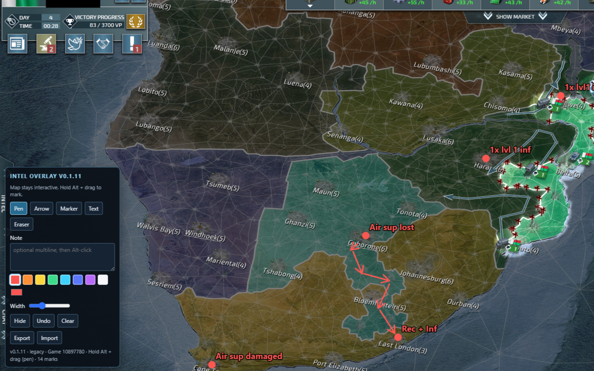

# CoN Intel Overlay

Chrome extension that lets you mark enemy positions and headings on the Conflict of Nations map. Marks are stored in the game's map coordinates, so they stay on the terrain when you pan or zoom.

The overlay works on both clients:

- **Modern** (`con-client-desktop`) — WebGL map, `mapWidget.viewport.toMapPos` / `fromMapPos`
- **Legacy** (`con-client`) — 2D canvas map, `mapWidget.mapRenderer.toMapPos` / `fromMapPos`

Marks are stored in map coordinates, so they stay on the terrain when you pan or zoom. The overlay uses `pointer-events: none` so the game keeps pan, zoom, and orders.

Captures are from an earlier build. Drop newer screenshot and video files in `media/` when you have them.

## Install

Sideload from this repo: [github.com/L4NK4P4TI/con-intel-overlay](https://github.com/L4NK4P4TI/con-intel-overlay)

1. Open `chrome://extensions`
2. Enable **Developer mode**
3. Click **Load unpacked**
4. Select this folder
5. Open a match on [conflictnations.com](https://www.conflictnations.com/) and **refresh** the tab after reloading the extension.

The toolbar shows the version, e.g. `Intel overlay v0.1.20`, plus `modern` or `legacy`. If you do not see that number, Chrome still has an old build loaded.

A panel labeled **Intel overlay** appears on the map.

## Use

- Hold **Alt** and drag to draw with the current tool. Normal mouse input still goes to the game.
- **Pen** — freehand stroke
- **Arrow** — enemy heading
- **Marker** — Alt-click a point
- **Text** — Alt-click to type a note. Enter starts a new line; Ctrl+Enter or Save places it. The Note field also accepts multiple lines, then Alt-click stamps them.
- **Range** — two presets, shortcut **Alt+5**:
  - **Reach** — Alt-drag sets combat size (then it locks). Radar and sight circles appear on the perimeter hub. Drag the origin to move everything; drag the hub to slide it around the ring; drag the **R** or **S** dots to resize radar and sight.
  - **Radar+Sight** — Alt-drag sets radar size; sight starts smaller. Drag the origin to move; drag the **R** / **S** dots to resize.
- **Eraser** — Alt-click a mark to delete it, or Alt-drag across several. The hovered stroke highlights first. Shortcut **Alt+6**. Separate from **Clear all** (trash), which wipes every mark in the match.
- Tools are icon buttons: **Alt+1** Pen, **Alt+2** Arrow, **Alt+3** Marker, **Alt+4** Text, **Alt+5** Range, **Alt+6** Eraser. **Alt+H** hides marks. Hover an icon for its name.
- Click a color swatch to switch quickly; the picker is still there for a custom color.
- **Export** / **Import** — download a `.json` sketch and send it to teammates. They import it in the **same match** so marks land on the same terrain. Import merges and skips duplicates.
- Drag the panel title to move it. Collapse (minus) shrinks it to a floating **Intel** button; drag or tap that button to restore.
- `Esc` — cancel the stroke or text in progress
- `Ctrl+Z` — undo

Strokes are saved per match in `chrome.storage.local`.

## Chrome Web Store

Listing copy, original icons, and a pack script live in `store/`. Run `.\store\pack.ps1` to build `dist/con-intel-overlay-0.1.13.zip`. See `store/LISTING.md`.

## How it stays geo-locked

World maps also wrap (`viewport.totalWidth` on modern, `mapSize.width` on legacy).
