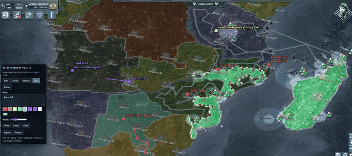

# CoN Intel Overlay

Chrome extension that lets you mark enemy positions and headings on the Conflict of Nations map. Marks are stored in the game's map coordinates, so they stay on the terrain when you pan or zoom.

The overlay works on both clients:

- **Modern** (`con-client-desktop`) — WebGL map, `mapWidget.viewport.toMapPos` / `fromMapPos`
- **Legacy** (`con-client`) — 2D canvas map, `mapWidget.mapRenderer.toMapPos` / `fromMapPos`

Marks are stored in map coordinates, so they stay on the terrain when you pan or zoom. The overlay uses `pointer-events: none` so the game keeps pan, zoom, and orders.

[Watch the full-quality demo](https://github.com/L4NK4P4TI/con-intel-overlay/blob/main/media/overlay-demo.mp4)

GitHub cannot play a repo `.mp4` inside the README, so the clip above is an animated version of the same recording.

## Install

Sideload from this repo: [github.com/L4NK4P4TI/con-intel-overlay](https://github.com/L4NK4P4TI/con-intel-overlay)

1. Open `chrome://extensions`
2. Enable **Developer mode**
3. Click **Load unpacked**
4. Select this folder
5. Open a match on [conflictnations.com](https://www.conflictnations.com/) and **refresh** the tab after reloading the extension.

The toolbar shows the version, e.g. `Intel overlay v1.2.6`, plus `modern` or `legacy`. If you do not see that number, Chrome still has an old build loaded.

A panel labeled **Intel overlay** appears on the map.

## Use

- Hold **Alt** and drag to draw with the current tool. Normal mouse input still goes to the game. The pointer follows the action: crosshair to draw, resize on range rings, move on handles, I-beam on notes, eraser on marks.
- **Pen** — freehand stroke
- **Arrow** — Alt-drag a heading. **Heads** and **Line** are Word-style dropdowns: start/end caps (None, Arrow, Stealth, Diamond, Oval) and Solid / Dash / Dot / Dash-dot. **Route** Alt-clicks waypoints; right-click finishes. Hold Alt to show tip handles; Alt-click a tip to cycle that cap. Drag tips or the line to adjust. Shortcut **Alt+2**.
- **Marker** — Alt-click a point. Pick from a short CoN icon set: pin, flag, strike, armor, air, navy, city, threat, star, recon.
- **Text** — Alt-click to type a note. Enter starts a new line; Ctrl+Enter or Save places it. The Note field also accepts multiple lines, then Alt-click stamps them. Alt-click an existing note to edit it; drag the pin (or the words) to move it. Empty Save deletes the note.
- **Range** — two presets, shortcut **Alt+5**:
  - **Reach** — Alt-drag sets combat size. Type km in the panel **C / R / S** fields, or Alt-click a **C / R / S** label on the map. Drag a ring or dot to resize; the origin stays put. Alt-double-click a ring also opens the km field. Combat shows **C** at the center when that origin is in view, and once on the visible rim. Radar and sight each get a single **R** / **S** label. When those rings sit on the combat perimeter, use the R/S labels or dots for sensors; the rest of the combat ring still resizes combat. Radar and sight start at the origin. Drag their hub anywhere **inside** the combat circle; the hub cannot leave that ring, but the radar/sight circles may extend past it. Drag the origin to move everything.
  - **Radar+Sight** — Alt-drag sets radar size; sight starts smaller. Type km in the panel **R / S** fields, or Alt-click a label. Drag the origin to move; drag rings or dots to resize.
- **Measure** — Alt-drag between two points to show distance in km. Uses the same map-space scale as Range (the camera tilt is only in the projection). Drag either end to adjust, or the line to move. Shortcut **Alt+6**. **Route** mode Alt-clicks waypoints and sums the path; right-click finishes. Terrain TTL / Air timing is in the code but **off** until it is accurate enough to ship.
- **Eraser** — Alt-click a mark to delete it, or Alt-drag across several. The hovered stroke highlights first. Shortcut **Alt+7**. Separate from **Clear all** (trash), which wipes every mark in the match.
- Tools are icon buttons: **Alt+1** Pen, **Alt+2** Arrow, **Alt+3** Marker, **Alt+4** Text, **Alt+5** Range, **Alt+6** Measure, **Alt+7** Eraser. **Alt+H** hides marks. Hover an icon for its name.
- Click a color swatch to switch quickly; the picker is still there for a custom color.
- **Export** / **Import** — download a `.json` sketch and send it to teammates. They import it in the **same match** so marks land on the same terrain. Import merges and skips duplicates.
- Drag the panel title to move it. Collapse (minus) shrinks it to a floating **Intel** button; drag or tap that button to restore.
- `Esc` — cancel the stroke or text in progress
- `Ctrl+Z` — undo

Strokes are saved per match in `chrome.storage.local`.

## Chrome Web Store

Listing copy, original icons, and a pack script live in `store/`. Run `.\store\pack.ps1` to build `dist/con-intel-overlay-1.2.6.zip`. See `store/LISTING.md`.

## How it stays geo-locked

World maps also wrap (`viewport.totalWidth` on modern, `mapSize.width` on legacy).
